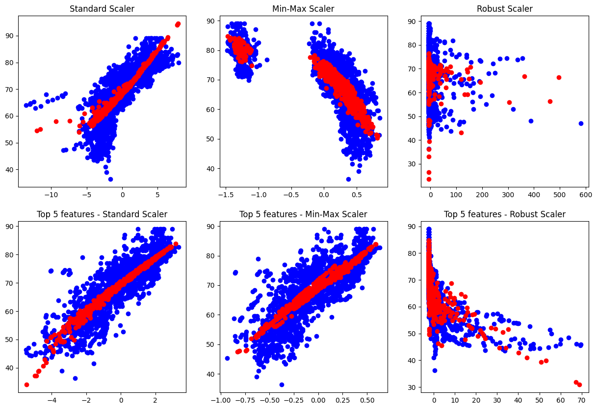

<!-- _class: center -->

# MidTerm Project
**Predicting Life Expectancy using Linear Regression**

Oct 30th, 2024
Yoji

--- 

# Agenda

1. Dataset overview
2. Key findings from EDA
3. Feature scaling
4. Regression models
5. Cross validation
6. Challenges

---

# Dataset overview

## Dataset information

- Dataset name: Life Expectancy (WHO)
- Dataset link: https://www.kaggle.com/datasets/kumarajarshi/life-expectancy-who/data

## Dataset size

- 22 columns
- 2938 records

---

# Key findings from EDA

Some data had null-values so I had to fill up these data
- Apply mean imputation for `int` and `float` columns.
- Apply mode imputation for `object` columns.

Perform one-hot-encoding for country column.

---

# Feature scaling

## Correlation matrix

Find out top 5 features based on the correlation matrix.
```
Life expectancy                    1.000000
Schooling                          0.715066
Adult Mortality                    0.696359
Income composition of resources    0.692483
BMI                                0.559255
HIV/AIDS                           0.556457
```

---

## Feature scaling

For this mid-term-project, I used 3 type feature scaling and 2 types of dataset. So totaling, it is 6 kind of feature scaling

- StandardScaler with entire data
- StandardScaler with top5-feature
- MinMaxScaler with entire data
- MinMaxScaler with top5-feature
- RobustScaler with entire data
- RobustScaler with top5-feature

And, compare result

---

# Regression models

## Train-test split

Before starting to make models, split data into train-data and test-data. This time I split data into 60%-40% and 80%-20% in order to compare results.

## Perform PCA

In order to warp into 2d numbers, perform PCA.

## Make models

Make models using with data which was performed PCA.

---

## Prediction

These scatter plot shows train data and prediction data.  
x-axis:features, y-axis:target, blue-plot:train-data, red-plot:test-data



---

## Evaluation with MAE, MSE, RMSE, and R2

Train-data:60%, Test-data:40%
```
                          Model       MAE         MSE       RMSE        R2
                Standard Scaler  4.558195   32.513194   5.702034  0.641470
                 Min-Max Scaler  9.579367  139.613058  11.815797 -0.539541
                  Robust Scaler  8.596135  125.391163  11.197820 -0.382714
Top5 features - Standard Scaler  9.791548  154.255161  12.419950 -0.701003
 Top5 features - Min-Max Scaler  9.992961  156.235747  12.499430 -0.722843
  Top5 features - Robust Scaler  9.977972  160.161032  12.655474 -0.766128
```

Train-data:80%, Test-data:20%
```
                          Model       MAE         MSE       RMSE        R2
                Standard Scaler  4.545390   32.062129   5.662343  0.636536
                 Min-Max Scaler  9.991245  157.483100  12.549227 -0.785267
                  Robust Scaler  8.077685  114.153075  10.684244 -0.294067
Top5 features - Standard Scaler  9.796859  156.941338  12.527623 -0.779125
 Top5 features - Min-Max Scaler  9.770935  150.164734  12.254172 -0.702304
  Top5 features - Robust Scaler  9.849289  158.176033  12.576805 -0.793122 
```

---

# Cross validation

Perform KFold cross-validation(splits: 5)
```
                          Model  Score(MSE)
                Standard Scaler   32.398139
                 Min-Max Scaler   36.830030
                  Robust Scaler   55.933006
Top5 features - Standard Scaler   20.863351
 Top5 features - Min-Max Scaler   28.347514
  Top5 features - Robust Scaler   21.614507
```

# Challenges

There was a lot of way to do feature scaling, split-data, and extract data. But I couldn't which way is most proper. So this time, I tried to perform everyway as far as I could and compare results. After all, I could figure out which one is most-fit-way.